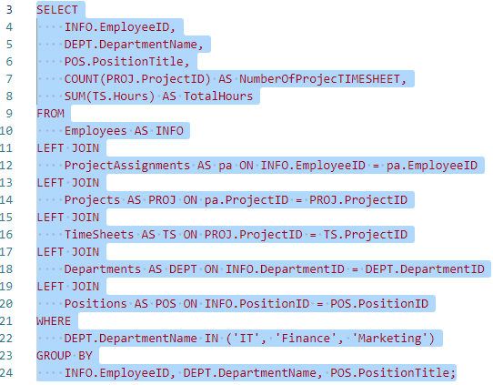
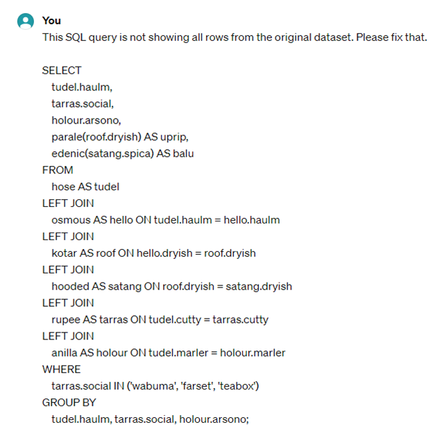
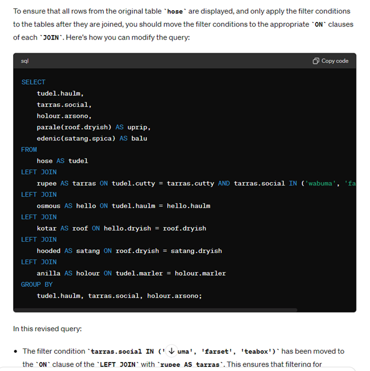
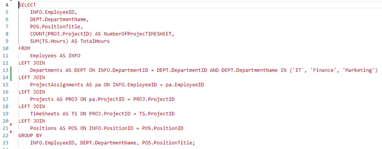

# Code Sanitizer

This extension allows to copy-paste code to and from VS code without sharing anything else than code keywords.

For example, when using SQL, words like SELECT and FROM will stay the same, but all table and field names will be replaced by a random dictionary word.

This allows to paste code into tools like chatGPT, or even public forums, without sharing any company secrets.

/* Only supports SQL for now */

## Features

Describe specific features of your extension including screenshots of your extension in action. Image paths are relative to this README file.

For example if there is an image subfolder under your extension project workspace:

### Step 1
Copy the code you want to sanitize using ctrl+shift+alt+C (cmd+shift+option+C on mac)

### Step 2
Paste the code normally (ctrl+V or cmd+V) in your favorite chat tool. 
Instead of the original code, it will be sanitized with random words!

### Step 3
If the chat tool gives you something you want to bring back to VS code, copy it (ctrl+C or cmd+C) 

### Step 4
Use ctrl+shift+alt+V (cmd+shift+option+V on mac) to paste it back in VS code.
Instead of the sanitized code, you will get the original names! Even if the code has changed (new lines of code, etc.)

